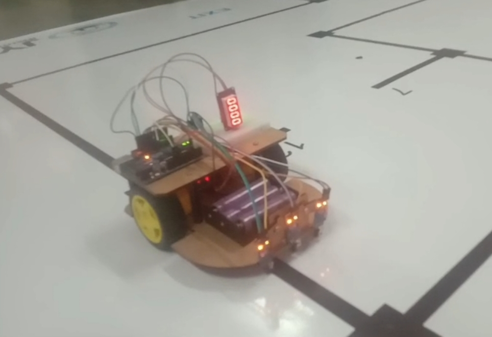

# 🤖 Grid-Based Line Following Robot

## 📌 Project Overview
This project is an autonomous grid navigation line-following robot built using Arduino Uno, 3 IR sensors, and an L298N motor driver.

The robot follows a predefined grid path, detects intersections (nodes), stops at each node for 15 seconds, reverses, and then navigates to the next vertical path. It continues this process until reaching the final exit path.

---

## 🧠 Key Features
- 3 IR Sensor Line Detection System
- Intersection (Node) Detection
- Node Counting Mechanism
- 15-Second Timed Stop at Each Node
- Reverse Navigation Logic
- Multi-Column Grid Traversal
- Exit Condition Handling

---

## 🛠 Hardware Components
- Arduino Uno
- 3 IR Sensors
- L298N Motor Driver
- 2 DC Motors
- Robot Chassis
- 7.4V Battery

---

## ⚙ Working Principle

The robot continuously reads three IR sensors:

- Left Sensor
- Center Sensor
- Right Sensor

### Line Following Logic:
- Center LOW → Move Forward
- Left LOW → Turn Left
- Right LOW → Turn Right
- All LOW → Intersection Detected

### Node Logic:
1. Detect intersection
2. Increment node counter
3. Stop for 15 seconds
4. Reverse slightly
5. Turn to next column
6. Continue line following

The robot stops permanently after reaching the final node (Exit).

---

## 🔁 Navigation Strategy

The robot performs structured traversal:
- Visits each grid node
- Performs timed operation (15 sec wait)
- Returns to base line
- Switches to next column
- Repeats until exit

---

## 🚀 Applications
- Warehouse automation systems
- Industrial inspection robots
- Smart agriculture row traversal systems
- Grid-based robotic navigation research

---

## 👨‍💻 Author
KIRANA A P
Robotics & AI Engineering Student

## 📷 Project Images

## 🎥 Demo Video:

[Watch Project Demo](video/robo.mp4)
